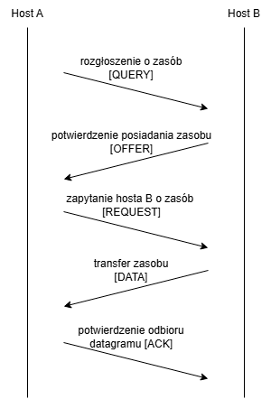

# PSI 24Z - Wstępna dokumentacja projektu

**Maksym Bieńkowski** (<01178511@pw.edu.pl>) | Jędrzej Grabski | Aleksander Drwal | Tomasz Kowalski

14.12.2024

## 1. Temat i treść zadania

### Program obsługujący prosty protokół P2P (Peer-to-Peer)

#### Założenia

- Zasób to obiekt z danymi binarnymi identyfikowany pewną nazwą. Za takie same zasoby uważa się zasoby o takich samych nazwach.
- Rozmiar zasobu jest znaczny (tj. większy od jednorazowego transferu sieciowego).
- Początkowo dany zasób znajduje się w jednym hoście, a następnie może być propagowany do innych hostów w ramach inicjowanego przez użytkownika “ręcznie” transferu. Raz pobrany zasób zostaje zachowany jako kopia.
- Po pewnym czasie działania systemu ten sam zasób może znajdować się w kilku hostach sieci.
- Program ma informować o posiadanych lokalnie (tj. w danym węźle) zasobach i umożliwiać ich pobranie.

#### Funkcjonalność programu

- Dodawanie nowych zasobów przez użytkownika – wprowadzanie z lokalnego systemu plików.
- Pobieranie zasobów:
  - Użytkownik może pobrać konkretny zasób po nazwie ze zdalnego hosta (jeden zasób na raz).
  - Użytkownik decyduje, z którego hosta dany zasób zostanie pobrany.
- Rozgłaszanie informacji o posiadanych lokalnie zasobach.

#### Dodatkowe założenia

- Zasób pobrany do lokalnego hosta jest kopią oryginału. Kopia jest traktowana tak samo jak oryginał (są nierozróżnialne), tj.:
  - Istnienie kopii jest rozgłaszane w taki sam sposób jak istnienie oryginału.
- Program powinien obsługiwać różne sytuacje wyjątkowe, np. przerwanie transmisji spowodowane błędem sieciowym.
- Lokalizacja zasobów odbywa się poprzez rozgłaszanie:
  - Wskazówka: użyć protokołu UDP, ustawić opcje gniazda `SO_BROADCAST`, wykorzystać adresy IP rozgłaszające (same bity “1” w części hosta).

#### Interfejs użytkownika

- Wystarczy prosty interfejs tekstowy.
- Interfejs powinien obsługiwać współbieżny transfer zasobów – tj. nie powinien się blokować w oczekiwaniu na przesłanie danego zasobu.

##### Wariant zadania W13/W22

- całość komunikacji (przesyłania zasobu) zrealizować na UDP, dodatkowo dla uproszczenia można przyjąć,
że zasób mieści się w całości w jednym datagramie (datagram danych może być zgubiony – należy to uwzględnić)
- implementacja w C++

## 2. Interpretacja treści zadania

**Główne funkcje programu:**

1. **Udostępnianie zasobów lokalnych:**

- Na urządzeniu hosta istnieje folder roboczy programu, którego zawartość będzie udostępniana innym.
- Udostępnienie zasobu jest równoznaczne z umieszczeniem go w tym katalogu.

```bash
> share /path/to/resource 
# równoznaczne ze skopiowaniem pliku /path/to/resource do /shared_folder
```

```bash
user@machine launch-program

Sharing resources from folder /shared_folder.
Shared resources:
file1.txt
file2.txt
```

2. **Rozgłaszanie udostępnianych zasobów:**

- Periodyczne wysyłanie listy dostępnych zasobów przy użyciu protokołu UDP w trybie broadcast.

3. **Aktualizacja dostępnych zasobów:**

- Po otrzymaniu wiadomości broadcastowej z listą udostępnianych przez hosta A zasobów, host B aktualizuje
listę dostępnych u A zasobów.

```bash
> list-resources

file1.txt
hosts: [host1, host2]

# otrzymanie wiadomości o file2.txt od hosta 1
> list-resources

file1.txt
hosts: [host1, host2]

file2.txt
hosts: [host1]
```

4. **Pobieranie zasobu:**

- Transfer zasobu z wybranego hosta inicjowany przez użytkownika programu.
- Plik pobierany jest do katalogu `shared_folder` i wiadomość o dostępności
wysyłana jest przy następnym rozgłoszeniu.

```bash
> download file1.txt host1  

Downloading file1.txt from host1...

>

Completed download of file1.txt from host1.
Available at shared_folder/file1.txt
```

5. **Obsługa sytuacji wyjątkowych:**

- Ponawianie zapytań w przypadku utraty datagramów, stosowanie prostego rozwiązania ACK.
- Informowanie użytkownika o niepowodzeniach transferu.

```bash
> download file1.txt host1  

Downloading file1.txt from host1...

Error while downloading file1.txt: could not connect to host1. Retrying...
Error while downloading file1.txt: could not connect to host1. Retrying...
Error while downloading file1.txt: could not connect to host1. Retrying...
Fatal: Error while downloading file1.txt: could not connect to host1. Retried 3 times.
# Usunięcie użytkownika host1 z pamięci do otrzymania od niego kolejnego broadcastu
```

6. **Sprawdzenie listy dostępnych zasobów**

- Po wpisaniu określonej komendy, wypisywane są adresy hostów wraz z udostępnianymi przez nich zasobami.

```bash
> list-resources

file1.txt
hosts: [host1, host2]

file2.txt
hosts: [host1, host3]
```

- Po wpisaniu innej komendy, wypisywane są adresy hostów udostępniających konkretny zasób.

```shell
> find file1.txt

file1.txt
hosts: [host1, host2]
```

## 3. Krótki opis funkcjonalny ("black-box")

### Użytkownik

- Może udostępniać zasoby ze swojego systemu plików.
- Może wywołać pobieranie zasobu o podanej nazwie z określonego hosta.
- Może przeglądać udostępniane przez określonego hosta zasoby.
- Może przeglądać wszystkie dostępne w sieci zasoby.
- Jest informowany o wystąpieniu błędów i niepowodzeń.

### Program

- Rozgłasza informacje o udostępnianych zasobach.
- Obsługuje prośby o przesłanie zasobów od innych hostów.
- Przesyła i odbiera zasoby.
- Zarządza transferami bez blokowania interfejsu użytkownika.
- Informuje użytkownika o wystąpieniu błędów i niepowodzeń.

## 5. Opis i analiza protokołów komunikacyjnych

Bazowy protokół - UDP

### Struktura nagłówka pakietu

- MSG_TYPE (unit8_t)
  - `RESOURCE_ANNOUNCE` - ogłoszenie lokalnie posiadanych zasobów
  - `RESOURCE_REQUEST` - prośba o udostępnienie określonego zasobu
   od konkretnego hosta
  - `RESOURCE_QUERY` -  rozgłoszenie zapytania o określony zasób do wszyskich hostów
  - `RESOURCE_DATA` - przesłanie zasobu do węzła, który go zażądał
  - `DATA_ACK` - potwierdzenie odebrania zasobu przez węzeł pobierający.
  Jeśli nadawca nie otrzyma potwierdzenia w określonym czasie, powtarza wysyłkę
  `RESOURCE_DATA`
  - `RESOURCE_OFFER` - wysyłany w odpowiedzi na `RESOURCE_QUERY`, potwierdza
  posiadanie zasobu, o który było zadane pytanie

- RESOURCE_NAME - uint8_t[128]
  - nazwa zasobu, tablica bajtów UTF-8, zakończona bajtem `\0`. Maksymalna
  długość nazwy zasobu wynosi w tym wypadku 127 bajtów.

- RESOURCE_SIZE (uint32_t) - długość zasobu w bajtach, wartość ma znaczenie
wyłącznie w przypadku pakietu `RESOURCE_DATA`

Za maksymalny rozmiar wysyłalnych danych uznajmy $65507 - 8 - 128 * 8 - 32  = 64443$ bajty.

#### Rozgłaszanie zasobów

- Diagram komunikacji:


#### Pobieranie zasobu

- Diagram komunikacji:


#### Pytanie o zasób i odpowiedź

- Diagram zapytania o zasób i odpowiedzi  



---

## 6. Planowany podział na moduły

### Moduły

1. *Moduł zarządzania zasobami:*

   - Obsługuje dodawanie, usuwanie i przegląd zasobów lokalnych.

2. **Moduł sieciowy:**

   - Rozgłaszanie zasobów.
   - Obsługa zapytań i transferu zasobów przy użyciu UDP.

3. **Moduł interfejsu użytkownika:**

   - Prosty tekstowy interfejs umożliwiający wykonywanie operacji przez użytkownika.

4. **Moduł obsługi wyjątków:**

   - Zarządza retransmisją utraconych datagramów i obsługą błędów.

### Rysunek struktury

## 

## 7. Zarys koncepcji implementacji

### Język programowania

- **C++**

### Biblioteki

- **Boost.Asio**: Obsługa gniazd sieciowych i operacji asynchronicznych.
- **STL**: Przechowywanie i zarządzanie danymi lokalnymi.

### Narzędzia

- **CMake**: System budowy projektu.
- **GCC/Clang**: Kompilator.

### Ogólne podejście do implementacji

1. Klasa `Resource` reprezentująca zasób.
2. Implementacja klasy `NetworkManager` do obsługi rozgłaszania i transferów.
3. Implementacja klasy `ResourceManager` do zarządzania zasobami.
4. Implementacja klasy `ExceptionManager` do obługi wyjątków.
5. Wdrożenie prostego interfejsu tekstowego opartego na pętlach zdarzeń.
